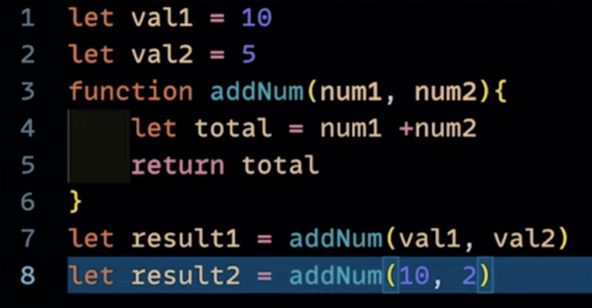

## Javascript Execution Context:

Global Execution Context: Sabse pehle banta and usko this variable de dia jaata. Window object

Functional Execution Context:

Eval Execution Context:

Javscript works in two phases
Two phases:

1. Memory Creation Phase/Creation Phase: memory alocation
2. Execution Phase

Steps:

1. Global Execution: this
2. Memory Phase:
   val1-> undefined
   val2->undefinef
   add num-> definition
   result1-> undefined
   result2-> undefined
3. Execution Phase:
   val1 -> 10
   val2->5
   add Num => new execution context(new variable enviroment sandbox, execution thread){

   1. Memory Phase:
      val1(num1)-> undefined
      val2(num2)-> undefined
      total -> undefined
   2. Execution Phase:
      num1->10
      num2->5
      total->15
      total return in global execution context
      }
      Delete execution context

   received value in result1

   result2 add num => new execution context(new variable enviroment sandbox, execution thread){

   1. Memory Phase:
      val1(num1)-> undefined
      val2(num2)-> undefined
      total -> undefined
   2. Execution Phase:
      num1->10
      num2->2
      total->12
      total return in global execution context
      }
      Delete execution context

   received value in result2
