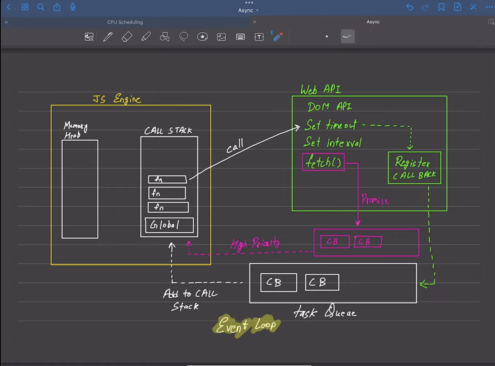

## Async in Javascript

Javascript is a synchronous language and is a single threaded (default behaviour).

### Execution context:

execute one line od code at a time; each operation waits for the last one to complete before executing.

## Blockind code:

Block the flow of program (Read file sync)

## Non Blocking code:

Does not block execution(Read file Async)

